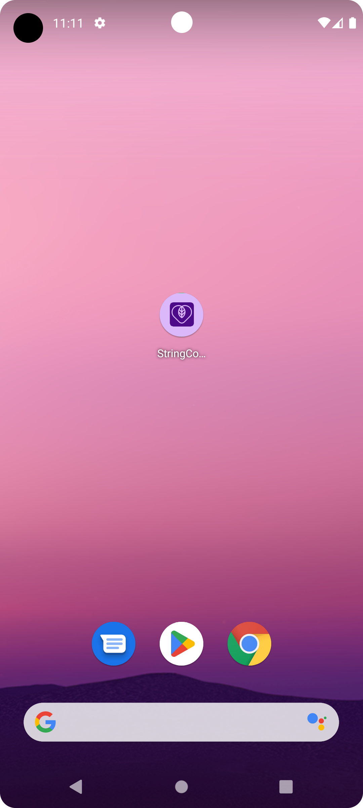
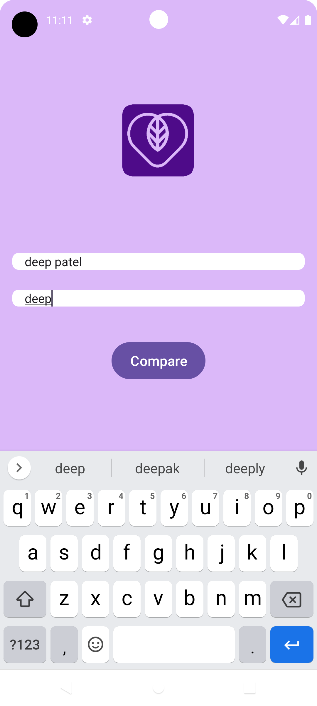
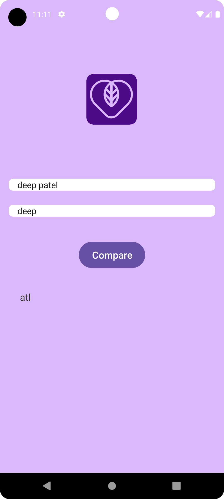
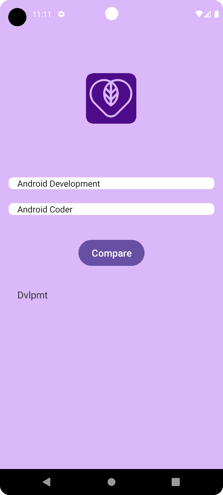

# StringCompareMaste

The "String Compare Master" is a simple and user-friendly Android application designed to compare and find unmatched characters between two input strings. Whether you're a developer working on text processing tasks or simply curious about comparing strings, this app provides an intuitive interface to accomplish such comparisons effortlessly.

Key Features:

Visual Input: The app features a visually appealing layout with an eye-catching app logo at the top, setting a welcoming tone for users.

Input Fields: Two input fields, labeled "Enter text 1" and "Enter text 2," allow users to input the strings they want to compare.

Comparison Button: The "Compare" button is prominently placed below the input fields, encouraging users to initiate the comparison process.

Unmatched Characters: Once the user clicks the "Compare" button, the app swiftly processes the input strings and identifies characters that are present in one string but not in the other.

Result Display: The unmatched characters are displayed in a well-formatted section below the "Compare" button. A clear and concise message is displayed to indicate the characters that differ between the two input strings.

Stylish UI: The app boasts an attractive background color and cohesive design, contributing to a pleasant user experience.

How to Use:

Launch the "String Comparison App" on your Android device.

Enter the first text string in the "Enter text 1" field.

Enter the second text string in the "Enter text 2" field.

Tap the "Compare" button to initiate the comparison process.

The app will identify and display the characters that are present in one string but not in the other in the "Result" section.

Why Use the String Comparison App:

Efficiency: The app simplifies the process of comparing strings, allowing you to quickly identify unmatched characters.

Coding Assistance: Developers can use this app to identify discrepancies in text strings, making it a valuable tool for debugging and troubleshooting.

Educational: The app is also a great way to learn about string manipulation and algorithmic concepts.

Whether you're a developer, a student, or someone interested in text comparisons, the "String Compare Master" offers a practical solution with an appealing interface. Download the app today and streamline your string comparison tasks with ease!

## <h1 align=center>Screenshots 📸</h1>

||||
|:----------------------------------------:|:-----------------------------------------:|:-----------------------------------------:|
|  |  |  |
|  |  |  |
|  |  >  |

<!--## App-Overview

 

  

  
